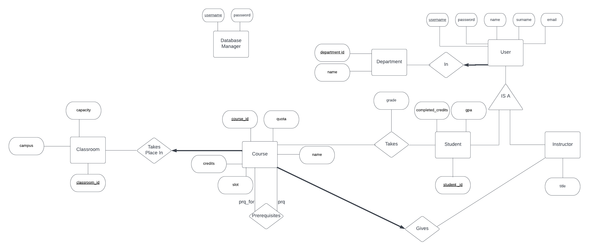
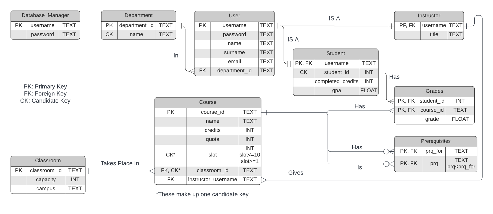

# CmpE-321-Project-3

## Authors

- Atilla Türkmen
- Onur Kömürcü

## Diagrams

### ER Diagram

### Schema

## Setup

NodeJS and MySQL are required to run the server.

- After configuring the MySQL server, run `createTables.sql` file to create the tables. (can be run on MySQL Workbench)
- Tables are created in a new schema that is named after student numbers of authors. Server uses this schema.
- Copy the template.env file and rename the copy as '.env'.
- Write your MySQL password and username in .env.
- Change MySQL port if it is different in your computer. Default MySQL port is 3306.
- Run `npm install` to install required packages.
- Finally type `node server.js` to start the server.
- Server runs on port 80.

## Requirements Progress

1. [X] DBM Login
2. [x] DBM Add User
3. [x] DBM Delete Student
4. [x] DBM Update Instructor Title
5. [X] DBM View Students
6. [X] DBM View Instructors
7. [X] DBM View Student Grades
8. [X] DBM View Courses of Instructor
9. [X] DBM Grade Average of Course
10. [X] Instructor Login
11. [X] Instructor View Available Classroom
12. [X] Instructor Add Course (**Trigger**)
13. [X] Instructor Add Prerequisite
14. [X] Instructor View Courses
15. [X] Instructor View Students in Course
16. [X] Instructor Update Course Name
17. [X] Instructor Give Grade (**Trigger**)
18. [X] Student List All Courses
19. [X] Student Add Course
20. [X] Student View Enrolled Courses
21. [ ] Student Search Course
22. [ ] Student Filter Courses (**Stored Procedure**)
